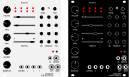

# Kaseta

Saturating tape delay and feedback sculptor module for Eurorack.

   

* Delay with 4 reading heads
* Tape saturation simulation
* Wow and flutter effects
* Stereo output
* Up to five minutes of recording
* Internal oscillator
* Trigger sequencer
* LEDs visualizing dialed parameters
* Based around Electro-Smith's [Daisy Patch SM](https://www.electro-smith.com/daisy/patch-sm) platform
* Programmed in Rust

Find more details about the module, including a feature overview video and a
user manual, on its [website](https://zlosynth.com/kaseta).

# Development

See [DEVELOPMENT.md](DEVELOPMENT.md) to find some basic commands to interact
with the project. To learn more, read the code. A good place to start would be
[firmware/src/bin/firmware.rs](firmware/src/bin/firmware.rs).

# License

Software of Kaseta is distributed under the terms of the General Public License
version 3. See [LICENSE-SOFTWARE](LICENSE-SOFTWARE) for details.

Schematics and PCB layout are distributed under the terms of Creative Commons
BY-SA. See [LICENSE-HARDWARE](LICENSE-HARDWARE) for details.

The manual is also distributed under the terms of Creative Commons BY-SA. See
[LICENSE-MANUAL](LICENSE-MANUAL) for details. To build flow diagrams present in
the manual, the project includes Matthias Hotz's
[tikz-dsp](https://texample.net/tikz/examples/fir-filter/) library under the
terms of Creative Commons BY 2.5.

# Changelog

Read the [CHANGELOG.md](CHANGELOG.md) to learn about changes introduced in each
release.

# Versioning

See [VERSIONING.md](VERSIONING.md) to find detailed information about versioning
of the project and compatability between its software and hardware.
